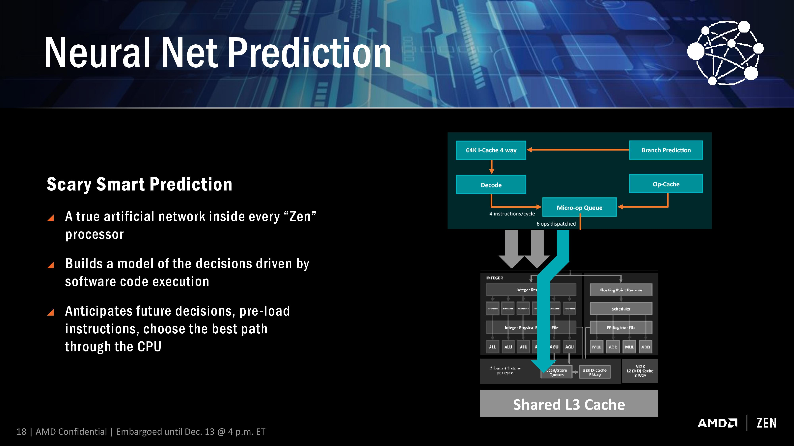
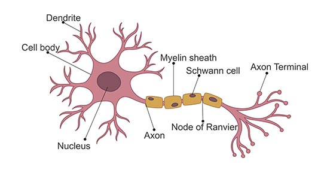
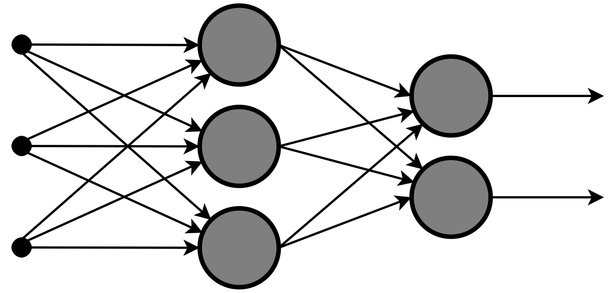
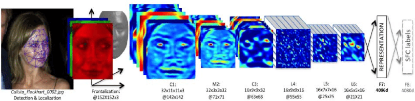
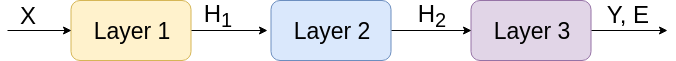
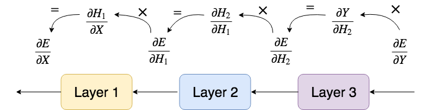

# Neural Networks (NN)
Neural Network is a term that is so popular that it has become mainstream.

{width=30%}

## Defintion (Oxford)

Neural Network is a system with a structure that is similar to the human brain and nervous system.

# History of NN - The downfall

**The promise**: If it works in nature, it must be able to work in computers.

::: columns

:::: {.column width=35%}
{width=100%}
::::
:::: {.column width=65%}

## 1949 - Started as a curosity of the human brain

In `A Logical Calculus Of The Ideas Immanent In Nervous Activity', electrical circuits model a simple neural network. Promise of computer intelligence.

## 1950s - Computers became more advanced

John von Neumann actually worked on NN; while all the hype was on Systems and the von Neumann architecture.
::::
:::

## 1970s - Many problems

Issues arising from Single layed neural network ro Multi-layered; Unfulfilled promises of NN -weak results; Very little interest due to the lack of funding.

# History of NN - The rise


::: columns

:::: {.column width=35%}
{width=100%}
::::
:::: {.column width=65%}

## 1980s - Multi-layer NNs

Researchers work on the forumulation of multi-layered neural networks.

## 1986 - Learning via Back-propagation

David Rumelhart came up with the idea now called back propagation networks because it distributes pattern recognition errors throughout the network; but its slow.

::::
:::

## 2010s - GPU Computation

With GPU compute, we are able to get around the problem of slow compute. Massively crunch a lot of data with many iterations.

## Today

Neural networks is a very `hot' research topic now due to its possibilites.

# Neural Network Applications

{width=70%}

{width=50%}

# Impressive, most impressive... But... 

The key mechanics for neural networks are the same; haven't really changed:

1. Neurons, input/output
1. Backpropagation

## Goal for today

1. Understand a neuron
1. Understand fully connected layer
1. Understand backpropagation

# Neuron

## Function

A neuron takes an input ($x$) and produces an output $f(x)$:

1. A very simple neuron is to just simply repeat the output: $f(x) = x$
1. Another is to negate the output: $f(x) = -x$

With this, you can build things but it is not very interesting.

## Tweakable function

Here we add new variables so that we can tweak them; we want some form of linear function and the ability to tweak them. 
Remembering secondary school $y = mx + c$.

. . . 

We are inspired to define with weights $w$ and bias $b$:

$$
f(x) = wx + b
$$

# Learning Neuron

We have some parameters $w,b$ which we want to discover:

1. Let's start with some random values of $w_1,b_1$.
1. We have an input/output that we want the neuron to learn $(x_1, y_1)$.
1. We can simply try $x_1$ with the neuron is, $f(x_1)= w_1 x_1 + b_1 = y_1'$.
1. Now we know how bad the neuron is, $\delta_y = y_1 - y_1'$
1. We can use differentiation to find how bad $w$ is, $\delta_y/\delta_w = x_1 \implies \delta_w = x_1 / \delta_y$!
1. We update $w_2 = w_1 - \delta_w$, same for $b_2$

Keep running the procedure for many different $(x, y)$ points and its learning!

# Neural Network Layers

A layer is a set of neurons that take in a vector $X$ and output $Y$:
$$
\Theta_{k,k+1}(x_k) = {x_k} W_{k,k+1} + b_{k+1}
$$

We see here, its essentially the same as just now but with matrices. 

{width=75%}

# Activation function

{width=50%}

Now our layer becomes: $\Theta_{k,k+1}(x_k) = \sigma({x_k} W_{k,k+1} + b_{k+1})$

# Fully-Connected Neural Network

A neural network $\Theta$ is a function that transform $x$ to $y$, ie. $\Theta(x)=y$. We will also let $x$ to be the row vector that corresponds to values of layer $0$, which is the input layer. We will also let $y$ to be the row vector that corresponds to the values of the final output layer. 
Using the defintion of weights $W$ and biases $b$ in the appendix and assuming the activation function is $\sigma(z)$, we are able to formulate the network mathematically for any layer($k,k+1$) transiting to the next:
$$
    \Theta_{k,k+1}(x_k) = \sigma({x_k} W_{k,k+1} + b_{k+1})
$$
Then, the neural network $\Theta$ with $n$ hidden layers would be the composition of these fuctions(Note that $x=x_0$):
$$
    \Theta(x) = \Theta_{n,n+1}\Big(\cdots\Theta_{1,2}\big(\Theta_{0,1}(x_0)\big)\Big)
$$

# Back Propagation

Essentially the same as the one neuron case, but with layers (ie. matrices).

{width=75%}

# Example - `Compressing' Neural Networks

Some nice or strange properties: We can `compress' a 3 layer neural network into a neural network with one layer:

$$
\Theta(x) = \Theta_{2,3}\Big(\Theta_{1,2}\big(\Theta_{0,1}(x)\big)\Big)
$$

So, expanding them:

$$
\begin{split}
    \Theta(x) & = \big[(x W_{0,1} +b_1) W_{1,2} +b_2\big] W_{2,3} +b_3 \\
              & = \big[x W_{0,1}W_{1,2} +b_1W_{1,2}+b_2\big] W_{2,3} +b_3\\
              & = x W_{0,1}W_{1,2}W_{2,3} +b_1W_{1,2}W_{2,3}+b_2W_{2,3} +b_3\\
              & = x(W_{0,1}W_{1,2}W_{2,3}) + (b_1W_{1,2}W_{2,3}+b_2W_{2,3} +b_3)\\
\end{split}
$$

# Code Example - `Compressing' Neural Networks

Access here: [https://github.com/eric-vader/simple-nn](https://github.com/eric-vader/simple-nn)

```python
i = lambda x: x # Identity function
i_ = lambda x: 1 # Identity function derivative

large_nn = NNBuilder().load(
  [i,i,i], 
  [i_,i_,i_], 
  nn_data_path, 
  [FullyConnectedLayer,FullyConnectedLayer,FullyConnectedLayer], 
  5)
small_nn = NNBuilder().load(
  [i], [i_], nn_result_path, [FullyConnectedLayer], 5)
```

